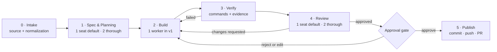

# Columbus: the component-first ticket-to-PR workflow

_Consolidated product and technical plan — rev. 2026-07-29._

_This document incorporates the manual workflow, the component-model discussion, and the technical
findings from the current Columbus implementation. It is the product-level source of truth. The
companion plans remain useful implementation references, but where they describe an individual
“Agent Step” as the top-level product primitive, this document supersedes them with a component-first
model:_

- _[`columbus-workflow-orchestration-plan.md`](./columbus-workflow-orchestration-plan.md) — durable
  runs, lifecycle, trigger wires, provider adapters, and recovery._
- _[`columbus-cross-agent-fork-plan.md`](./columbus-cross-agent-fork-plan.md) — native same-vendor
  forks and measured cross-vendor context handoffs._

---

## 1. Product thesis

Columbus should let a user describe the **stages and control boundaries of a coding workflow once**,
then run that workflow from a Linear issue, Jira ticket, Markdown document, or rough idea without
manually copying context between agents.

The unit a user places on the canvas is a **component**. A component has a job, declared inputs,
declared outputs, permissions, completion rules, and zero or more execution seats. An agent is one
possible executor inside a component; it is not the workflow abstraction. **Every agent seat remains
a real, visible, user-controllable CLI.** The component groups and automates agents; it never hides
or takes ownership of them away from the user.

The intended experience is:

1. Choose a project and a reusable workflow board.
2. Supply a source and a small number of run-level instructions.
3. Preview the resolved models, prompts, permissions, commands, gates, and external effects.
4. Press **Run workflow**.
5. Watch every active seat from the canvas, open and use any agent CLI directly, modify its course,
   or let deterministic control code advance the workflow.
6. Reach a reviewed change and, after an explicit gate, an open PR.

The central promise is:

> Configure the work and its control boundaries at the beginning; Columbus then advances from
> source to reviewed result without manual handoffs, while every agent remains visible, editable,
> and directly usable by the user.

### 1.1 Decisions in one page

| Question                                                          | Decision                                                                                                                                |
| ----------------------------------------------------------------- | --------------------------------------------------------------------------------------------------------------------------------------- |
| What does the user compose?                                       | **Components**, not individual agents                                                                                                   |
| How do components exchange work?                                  | Versioned, validated artifacts; not chat summaries                                                                                      |
| Are session forks the workflow data model?                        | No. Forks are an optional context optimization; artifacts are the correctness boundary                                                  |
| Can every component have 1–3 agents?                              | No. Seat count and reconciliation depend on the component's work type                                                                   |
| Where is multi-agent work valuable first?                         | Planning and review, where outputs are documents and read-only analysis                                                                 |
| Do multiple workers merge implementations by consensus?           | No. v1 uses one worker; later modes are partitioned work or bake-off in isolated worktrees                                              |
| Does the PR component autonomously resolve and publish conflicts? | No. Publishing is a gated external action; code-changing conflict resolution returns through Build → Verify → Review                    |
| Does Columbus modify the user's active worktree?                  | No. A run should own an isolated worktree from v1                                                                                       |
| Who controls each agent?                                          | The user. Every seat exposes its real CLI and can be inspected, prompted, modified, resumed, forked, stopped, or taken over at any time |
| Can agents run invisibly?                                         | No. Columbus must not create a background agent that the user cannot open and control                                                   |
| What is the v1 UI strategy?                                       | Typed component presets backed by a shared runtime; expose a generic custom builder only after the presets are proven                   |

### 1.2 Full agent control is a product invariant

Automation is an optional operating mode, not a replacement for the agent CLI. For every agent seat,
the user can:

- open the actual Claude or Codex CLI and see what it is doing;
- type directly into it, answer questions, send follow-up prompts, and run normal CLI commands;
- inspect or change its model, effort, permissions, and next-turn prompt, subject to explicit safety
  confirmation when permissions increase;
- pause automated ownership, modify files or direction manually, resume or fork the session, and
  return control to Columbus;
- cancel, restart, or leave the seat under manual control.

Columbus may launch and coordinate bounded turns, but it must never create a hidden “headless-only”
agent with no direct user path to the underlying CLI. When the user intervenes, Columbus records the
transition, pauses dependent automation, and waits for an explicit handback before validating the
result and continuing. The user is always the final authority over the agent and the workflow.

---

## 2. The workflow we are productizing

The current manual workflow is effective:

1. A strong planner reads a Linear issue and produces a plan.
2. A worker inherits the intent and implements it.
3. A reviewer with planning context but no implementation authorship reviews the change.
4. A second, often cross-vendor reviewer adds a different model-family perspective.
5. The worker absorbs feedback.
6. A final agent commits, pushes, and opens the PR.

The valuable properties are worth preserving:

- planning quality sets the ceiling for implementation quality;
- review should be independent of implementation authorship;
- the same worker identity can absorb several feedback rounds;
- model diversity can expose different failure modes;
- the user can see and interrupt the work.

But the five-agent chain should **not** be encoded as the product. It is one runtime configuration
of a more reusable component workflow. It also mixes model work, deterministic checks, control
gates, and external effects as if they were all agents. They are not.

### 2.1 Recommended default board



This keeps the discussion's component-first shape but adds an explicit **Verify** component and
reframes “PR agent” as **Publish**:

- verification is evidence-producing work with a different completion contract from subjective
  review;
- commit, push, and PR creation are idempotent external actions, not open-ended agent reasoning;
- an agent may draft a PR body or help with integration, but deterministic code owns the external
  effect.

### 2.2 The six default components

| #   | Component           | Execution shape                                                 | Job                                                                                                | Canonical outputs                                                         |
| --- | ------------------- | --------------------------------------------------------------- | -------------------------------------------------------------------------------------------------- | ------------------------------------------------------------------------- |
| 0   | **Intake**          | Connector, optional normalizer                                  | Snapshot the source, preserve provenance, and form a usable problem statement                      | `SOURCE.md`, `source.json`, `PROBLEM.md`                                  |
| 1   | **Spec & Planning** | 1 planner; optional 2 planners + arbiter                        | Resolve ambiguity, define scope and acceptance criteria, and produce the implementation plan       | `SPEC.md`, `PLAN.md`, `DISPUTES.json`                                     |
| 2   | **Build**           | 1 worker in v1                                                  | Implement the current plan or address current findings                                             | controller-captured `CHANGESET.patch`, `IMPLEMENTATION.md`, `change.json` |
| 3   | **Verify**          | Deterministic commands; optional diagnostic agent after failure | Run configured tests, type checks, lint, and other project checks against a frozen change revision | `verification.json`, logs, optional `DIAGNOSIS.md`                        |
| 4   | **Review**          | 1 reviewer; optional 2 independent reviewers                    | Review the exact verified revision and emit typed findings and a verdict                           | `REVIEW.md`, `review.json`                                                |
| 5   | **Publish**         | Deterministic adapter; optional writing assistant               | Confirm target freshness, prepare commit/PR text, push, and create or update one PR                | `PR_DRAFT.md`, `publication.json`                                         |

The approval gate is a first-class control component between Review and Publish. Additional gates may
appear after unresolved planning disputes, exhausted repair loops, detected target-branch drift, a
permission request, or a human takeover.

### 2.3 Intake is not always agentless

The original component proposal made Source a deterministic adapter that always emitted
`PROBLEM.md`. That is too strong.

Fetching a Linear or Jira issue is deterministic. Turning a half-formed idea into a well-scoped
problem can require reasoning and questions. Intake therefore has two layers:

1. **Capture** writes an immutable source snapshot and provenance: provider, source identifier,
   fetched revision/time, attachments, and original text.
2. **Normalize** creates `PROBLEM.md`. It may be a deterministic template for a structured ticket or
   an agent seat for an unstructured idea. Ambiguity is recorded, not invented away.

Downstream components read `PROBLEM.md`, but the original `SOURCE.md` remains available for audit
and for checking whether normalization lost important detail.

### 2.4 Component types

The canvas should present a consistent component card, but the runtime must recognize different
execution types:

| Type                   | Examples                                    | Key property                                             |
| ---------------------- | ------------------------------------------- | -------------------------------------------------------- |
| **Input / connector**  | Linear, Jira, Markdown, free text           | Captures external input and provenance                   |
| **Agent work**         | Plan, Build, Review, diagnose               | Runs one or more bounded model turns                     |
| **Command / verifier** | Tests, type check, lint, build              | Structured argv, exit code, logs, no model required      |
| **Gate / router**      | Human approval, outcome branch, budget stop | Changes control flow without doing project work          |
| **External action**    | Commit, push, open PR, update ticket        | Side-effecting and idempotent; authorization is explicit |

This is more honest than forcing every stage into “N agents + consolidation.” The cards can share a
shell and common contracts without pretending their risk and completion semantics are identical.

---

## 3. The durable product model

Five layers must remain distinct:

| Layer                  | Meaning                                                                 | Lifetime                                        |
| ---------------------- | ----------------------------------------------------------------------- | ----------------------------------------------- |
| **Board definition**   | Reusable components, wires, prompts, policies, gates, and inputs        | Edited and reused across runs                   |
| **Workflow run**       | Immutable board snapshot plus resolved run inputs and execution profile | One end-to-end execution                        |
| **Component instance** | One component's state within a run, including input/output revisions    | May recur in a bounded loop                     |
| **Seat attempt**       | One provider process or command attempt                                 | Immutable evidence; retries create new attempts |
| **Artifact**           | A versioned, validated work product passed between components           | Immutable after promotion                       |

This separation resolves an important retry issue. The **component** is the user's unit of control
and completion, but the **seat attempt** is the scheduler's unit of execution and recovery. If one
of two planner seats fails because a provider is temporarily unavailable, Columbus can retry that
seat without discarding the successful plan. If the user chooses “rerun Planning from scratch,” a
new component instance is created and both seats run under the selected policy.

### 3.1 Component contract

Every component definition declares:

- typed inputs and required artifact revisions;
- execution type and seats, if any;
- provider, model, effort, permission profile, timeout, and role bias per seat;
- allowed workspace paths and whether the component may mutate project files;
- required outputs with schemas and validators;
- reconciliation policy for multi-seat output;
- success, failure, `needs_input`, and escalation behavior;
- retry policy and maximum attempts;
- advance conditions and loop bounds;
- external effects and required approval gates;
- human-control policy and the seat's current automation/ownership mode;
- cost and turn ceilings.

A component succeeds only when its execution has reached a terminal state **and** every required
output has been validated and promoted. Exit code 0 plus a missing artifact is a failed contract,
not success.

### 3.2 Presets first, generic builder later

The runtime should use a shared component schema now, but v1 should expose the six typed presets
rather than a completely generic component designer. A premature generic builder would make users
configure schemas, joins, retries, permissions, and side effects before the team knows which
controls matter in real runs.

The extension path remains deliberate:

1. ship the default presets;
2. validate at least two additional workflows, such as PR review and test-failure diagnosis;
3. expose **Duplicate as custom component** using the proven fields;
4. add a low-level custom contract editor only for advanced users.

The presets are not a permanent enum, but the generic abstraction should be earned through usage.

---

## 4. Multi-agent behavior by component

“1–3 agents” should not be a universal slider. Parallel agents create value only when their outputs
can be compared or combined safely. Columbus should expose named execution modes whose consequences
are understandable.

### 4.1 Planning: independent first, then one critique round

Planning is the safest and highest-value fan-out:

1. Planner A and Planner B receive the same source artifacts but different role biases. They work
   independently and cannot see one another's draft.
2. Each receives the other plan under neutral labels and writes one structured critique covering
   correctness, scope, risk, test strategy, and unnecessary complexity.
3. A **fresh arbiter session** receives the source, both plans, and both critiques. It writes one
   `PLAN.md` plus `DISPUTES.json`.
4. Empirical disputes become a requested spike or evidence task. Unresolved high-impact judgment
   calls pause at a human gate.

One critique round is the default maximum. More rounds create cost and social convergence without
reliably adding evidence. The arbiter is fresh rather than a planning seat so it has no authorship
bias. It is also not described as “forked from Source,” because Intake may have no agent session;
the artifact set is the complete and portable input.

Recommended role biases:

- **Seat A — minimal:** prefer the smallest change that fully satisfies the acceptance criteria.
- **Seat B — durable:** prefer the design that leaves the codebase easiest to understand and extend.

Cross-vendor seats are the strongest diversity lever. Different model/effort tiers are second.
Role wording is useful but should not be mistaken for independent model families.

### 4.2 Build: one worker first

Multiple agents editing the same working tree is not collaboration; it is a race. Multiple agents
producing independent implementations also do not create a principled “consensus diff.” Semantic
merge is itself an implementation task and can silently combine incompatible assumptions.

Build therefore supports:

| Mode                | Shape                                                                                                                                 | Decision                                            |
| ------------------- | ------------------------------------------------------------------------------------------------------------------------------------- | --------------------------------------------------- |
| **Single**          | One worker owns the run worktree and all repair rounds                                                                                | **v1 default**                                      |
| **Partitioned**     | The plan declares disjoint work packages, dependencies, file ownership, and integration order; each seat gets a worktree              | Later, after worktree and dependency support        |
| **Bake-off**        | Several seats implement in separate worktrees; a judge selects one complete candidate; losers are retained as evidence but not merged | Later, for high-risk or unusually difficult tickets |
| **Consensus merge** | Several overlapping diffs are merged into one                                                                                         | **Rejected**                                        |

Even after worktrees exist, a simple `workers: 3` setting is insufficient. The user must select a
mode, and the UI must explain whether work is partitioned or mostly discarded in a bake-off.

### 4.3 Review: independent findings, conservative join

Review fan-out is also safe because reviewers are read-only and review a frozen revision. Reviewers
should start as fresh artifact-driven sessions by default. Forking from a planner can be offered as
a continuity preset, but it is not required for correctness and may preserve planning blind spots.

Reviewers do not need to debate until they agree. Disagreement is useful evidence. Each writes a
typed `review.json`; the aggregate rule is:

> The change is approved only when every required reviewer approves the same change revision and
> there are zero unresolved blocking findings.

A deterministic join unions blocking findings. An optional agent may deduplicate or clarify prose,
but it cannot silently downgrade a blocking finding. A disputed blocker is resolved by evidence, a
new implementation revision, or a human decision—not by majority vote.

### 4.4 Verify and Publish do not benefit from seat fan-out

Verification should run the configured commands. An agent may diagnose a failure after evidence
exists, but two agents do not make a test command more true.

Publish should use one idempotent adapter. An agent can draft or refine the PR description, but
commit, push, and PR creation must have stable idempotency keys and an explicit authorization gate.

### 4.5 Adaptive fan-out

The default board should use one planner and one reviewer. A **Thorough** preset enables two planning
seats and/or two review seats. Later, Columbus may recommend thorough mode when it detects high risk,
large scope, security-sensitive paths, ambiguous acceptance criteria, or user-defined labels—but it
should never silently multiply spend.

The run dialog shows estimated seats, maximum turns, and budget before launch. Near-identical plans
are surfaced as a diversity signal so the user can see when fan-out did not earn its cost.

---

## 5. Artifacts are the component bus

Components communicate through declared files. Deterministic controller code selects the inputs,
renders the next prompt, validates outputs, and records provenance.

The precise rule is:

> No component needs a separate agent turn whose only purpose is to summarize work for the next
> component. Its substantive artifact is the handoff.

This does not forbid a final assistant message for human readability. It means chat prose is not the
semantic data contract and downstream execution never depends on parsing a confident-sounding final
sentence.

### 5.1 Private control state and agent-visible exchange are separate

One folder should not serve both audit/security needs and agent workspace access. Use two layers:

```text
<fleetlog-user-data>/columbus/projects/<project-id>/runs/<run-id>/
  board.snapshot.json
  inputs.snapshot.json
  run.json                         # rebuildable materialized view
  events.jsonl                     # append-only authority
  prompts/<component>/<seat>/<attempt>.md
  attempts/<component>/<seat>/<attempt>/
    stream.jsonl
    stderr.log
    exit.json
  artifacts/manifest.jsonl         # authoritative promoted-artifact index

<run-owned-worktree>/.fleetlog/run/
  in/<component>/<instance>/       # controller-staged, read-only inputs
  out/<component>/<seat>/<attempt>/# seat-writable candidate outputs
  promoted/<artifact-id>/          # validated exchange copies
```

- Private state contains prompts, event history, streams, process identity, and redacted evidence.
  Agents do not need access to it.
- The exchange folder contains only the inputs and outputs required for component work.
- The controller stages inputs, validates outputs, calculates hashes, and promotes immutable copies.
- The project diff excludes `.fleetlog/`, and Publish fails if any Fleetlog path is staged or
  unignored.

The preferred v1 layout is one **run-owned Git worktree** under Fleetlog's project data directory,
with agent processes launched using that worktree as their cwd. This protects the user's current
working directory and naturally makes the exchange folder visible to workspace-restricted agents.
The Phase 0 spike must validate both vendor sandboxes against this layout. If a provider cannot work
there, the fallback is a project-local ignored worktree—not mutation of the user's active tree.

### 5.2 Artifact envelope

File existence alone is not enough. Every promoted artifact has controller-owned metadata:

```json
{
  "schemaVersion": 1,
  "artifactId": "uuid",
  "kind": "plan",
  "path": "promoted/<artifact-id>/PLAN.md",
  "sha256": "...",
  "producer": {
    "runId": "...",
    "componentId": "planning",
    "componentInstance": 1,
    "seatId": "planner-a",
    "attempt": 1
  },
  "inputRevision": 1,
  "createdAt": "..."
}
```

The controller rejects symlinks, traversal, paths outside the seat's output directory, malformed
JSON, unknown schema versions, and over-size artifacts. Agents write candidate output; they do not
edit the manifest or promote their own result.

### 5.3 Controller-captured evidence

Some outputs must never rely on agent self-report:

- the controller captures the base commit and target commit;
- the controller captures the worktree patch, untracked files, and changed-file list after Build;
- Verify captures command argv, cwd, environment references, exit codes, durations, and logs;
- Publish records the actual commit SHA, remote, branch, PR URL, and provider response.

`IMPLEMENTATION.md` may explain a change; `CHANGESET.patch` is what actually changed.

### 5.4 Revision pinning

Every Build completion creates a monotonically increasing `changeRevision`. Verify and Review
declare the exact revision and patch hash they evaluated. Any subsequent code change invalidates
their approval.

Publish may proceed only when:

- the current worktree hash matches the approved revision;
- required verification passed for that revision;
- every required review seat approved that revision;
- the target branch has not moved since the configured integration point, or target drift has been
  handled by policy and the resulting revision re-verified and re-reviewed.

This prevents a common but dangerous shortcut: resolving a rebase conflict inside the PR step and
publishing code that no reviewer actually saw.

---

## 6. Prompt ingestion and control

Prompt cards are valuable because users want to steer each component without rebuilding the board.
They must be powerful without being able to weaken system invariants.

### 6.1 Prompt layers

The controller assembles and snapshots each seat prompt in this order:

1. **Controller invariants** — output locations, safety boundaries, artifact rules, and lifecycle
   protocol. Not user-editable.
2. **Component contract** — the preset's role, inputs, outputs, and definition of done.
3. **Board instructions** — persistent team/project conventions.
4. **Run-level prompt card** — applies to every component in this run.
5. **Component prompt card** — run-specific steering for this stage.
6. **Seat role bias** — the deliberate diversity instruction.
7. **Artifact references** — source and upstream work, clearly delimited as data.

The assembled prompt is immutable once the attempt is queued and is previewable before launch.
Historical runs retain the exact non-secret prompt. Secret values are injected at execution time and
stored only as redacted references. “Immutable” here means Columbus never rewrites history: the user
can still open the CLI and send a new instruction, but that instruction becomes a new recorded turn
or attempt rather than silently changing the prompt that already ran.

### 6.2 Instructions and source content are different trust domains

Linear descriptions, Jira comments, repository documents, and upstream artifacts may contain text
that looks like instructions. The prompt composer must label them as untrusted task data and keep
them outside the controller-invariant and component-contract sections.

User prompt cards may steer implementation choices, but they cannot:

- grant a permission not present in the execution profile;
- remove required outputs or validation;
- bypass a gate or external-effect authorization;
- change another seat's private output before promotion;
- mark an unverified revision approved.

### 6.3 Size and cost controls

Large inputs are passed by validated paths plus focused indexes, not pasted repeatedly. Each
component declares prompt and artifact size limits. The run has per-seat turn caps, component retry
caps, a total budget ceiling, and a visible policy for what happens when the ceiling is reached.

---

## 7. Orchestration and execution

### 7.1 The controller is durable and server-side

A workflow may run for hours and must survive a browser refresh, HMR, a closed tab, or a Columbus
restart. React and Vite middleware cannot be the lifecycle authority.

Use a long-lived `columbus-controller` service/process. Its non-negotiable responsibilities are:

- validate and snapshot the board, inputs, execution profile, and target Git state;
- create and own the run worktree;
- append state transitions to `events.jsonl` with monotonic sequence numbers;
- durably write `launch_requested` before spawning a process;
- identify attempts and sessions without cwd/time heuristics;
- reconcile running or ambiguous attempts after restart;
- enforce idempotency, locks, loop bounds, retries, timeouts, budgets, and gates;
- promote validated artifacts and resolve ready components;
- serialize external effects and record their idempotency keys;
- expose a stream of events to the canvas.

`run.json` is a materialized view and may be rebuilt. It is not the authority.

### 7.2 Full CLI control and exact completion are compatible

Each agent seat is backed by a persistent tmux pane that can host the actual Claude or Codex CLI. The
user can open that pane at any time and use it like a normal terminal. Columbus does not replace the
CLI with a synthetic log viewer.

During automated ownership, a provider-specific adapter runs one bounded CLI turn in the pane:

1. launch the real provider CLI with structured streaming enabled;
2. show its live output and actions in the embedded terminal;
3. write the structured stream and final exit record atomically;
4. retain the session identity and pane so the user can inspect, resume, or fork it.

If the user chooses **Control CLI**, Columbus interrupts or waits for the bounded automated turn,
marks the seat as human-controlled, and opens the interactive provider CLI against the same session
and worktree. Downstream scheduling pauses while the user can prompt the agent, answer questions,
change files, or use the surrounding shell. **Return to workflow** ends interactive ownership,
captures the resulting state, and re-runs the component's output validation before any trigger fires.

The controller still decides automated completion from its owned process, durable event, and
validated outputs. It never infers success from terminal liveness, a quiet transcript, or
final-message sentiment. This distinction preserves full user control without making terminal
heuristics the workflow protocol.

### 7.3 Lifecycle

Seat attempts use explicit states:

```text
ready → queued → preparing → running
                            ├→ needs_input → running
                            ├→ succeeded
                            ├→ failed
                            ├→ timed_out
                            ├→ canceled
                            └→ taken_over
```

Component state is an aggregate over required seat attempts, reconciliation, artifact validation,
and gates. A component may be `waiting_for_seats`, `reconciling`, `awaiting_approval`, or
`blocked_by_budget` even though no provider process is running.

Ownership is an orthogonal state: `automated`, `takeover_requested`, `human_controlled`, or
`handback_pending`. A human-controlled seat never auto-advances. Handback creates a durable event and
requires the same artifact and revision checks as an automated completion.

### 7.4 Session identity is continuity, not a hidden bus

A “long-lived worker” means a stable provider session ID across bounded turns. The process itself
does not need to stay running. Review feedback can resume the same worker session for a repair turn,
then exit and produce a new revision.

Native same-vendor forks and cross-vendor handoff packets remain useful for:

- a user-created exploratory fork;
- optionally seeding a worker with planner context;
- continuing an unusually context-heavy investigation.

But downstream correctness may not depend on invisible inherited context. Every component must be
able to start from its declared artifacts. Reviewers are fresh artifact-driven sessions by default.
This makes runs reproducible, cross-vendor execution possible, and artifact contracts testable.

### 7.5 Human CLI input is first-class; automated handoffs remain acknowledged

Pasting text into a live TUI has no acknowledgement, no stable cursor state, no result identity, and
no reliable completion event for a scheduler. That does **not** limit the user's ability to type into
the CLI. Human input is a first-class control path and is recorded as human-controlled activity.
Automated repair turns use provider resume commands through the adapter and produce a new seat
attempt rather than pretending blind keystroke injection is an acknowledged orchestration event.

### 7.6 Git and worktree policy

The user's active worktree is read-only to the workflow. Run preparation should:

1. validate the repository, selected base, remotes, and current target SHA;
2. refuse ambiguous or unsupported repository states;
3. create a run-owned branch and isolated worktree;
4. install a local ignore rule for the exchange directory and verify it with Git;
5. record the base and target SHAs before any agent launches.

Network fetch is an explicit preflight action, not reasoning delegated to the planner. A workflow
may use the currently available target SHA when offline if the board policy permits it and the run
records that fact.

A single writer lease protects each run worktree. Planning and Review seats are read-only and may
run concurrently. Later Build fan-out receives one worktree per seat.

### 7.7 Repair loop

The loop is component-to-component:

```text
Build revision N → Verify N → Review N
        ▲               │          │
        └──── failure ──┘          └── changes_requested
```

The same worker session receives structured verification or review artifacts. Each repair creates a
new Build component instance and change revision. The default maximum is **two repair rounds** after
the first implementation. Exhaustion pauses for a human decision: continue with a higher bound,
take over, change the plan, or stop. It never silently publishes the last attempt.

### 7.8 Retry semantics

- Read-only or document-producing seat attempts may retry automatically for infrastructure failure.
- A failed seat in a multi-seat component can retry without rerunning successful seats.
- Semantic failure does not automatically retry with the same prompt.
- Build retry continues from the run-owned worktree by default. Before retry or cancellation, the
  controller snapshots the current patch and untracked files.
- “Restart Build from component entry” is a separate, explicit operation that preserves the current
  patch as evidence before restoring the run worktree. It is never an automatic reset.
- Publish retries use stable idempotency keys and first query whether the commit, push, or PR already
  exists.

### 7.9 Target drift and conflicts

Publish checks whether the target branch has moved since the reviewed integration point.

- If it has not moved, Publish proceeds.
- If it moved without affecting the change under the configured policy, Columbus records the new
  base and reruns the required verification.
- If integration changes project files or creates conflicts, control returns to an Integration/Build
  turn, followed by Verify and Review of a new revision.

Conflict resolution is code modification. It cannot be hidden inside a publishing action after the
review gate.

---

## 8. Canvas experience

### 8.1 Component containers

Each component is one canvas node. When collapsed it shows:

- component type and purpose;
- aggregate lifecycle status and elapsed time;
- seat count, vendors, and models;
- current input and output revisions;
- gate, loop, permission, and cost indicators;
- the next transition or blocking reason.

Expanding the component reveals a real CLI pane for each seat alongside its structured event view,
prompt preview, attempt history, produced artifacts, and reconciliation evidence. The CLI is usable,
not a read-only rendering. Fan-out should never appear as a pile of unlabelled terminals.

### 8.2 Board view and run view are distinct

- **Board view** edits reusable definitions, prompts, policies, and connections.
- **Active run view** shows a frozen board snapshot plus current execution state.
- **Historical run view** is read-only evidence with **Run again** and **Reproduce run** actions.

Editing a board while a run is active does not mutate that run.

### 8.3 Prompt controls

The run dialog provides a compact run-level prompt. Every component card provides its own optional
prompt card. Seat role biases are advanced board configuration. The UI can preview the exact
assembled prompt per seat and highlight which text came from which layer.

### 8.4 Full per-agent CLI control

Every agent seat offers:

- **Open CLI** — see and use the actual provider terminal, not only a summarized activity stream;
- **Control CLI** — pause automated ownership and interact with the same session and worktree;
- **Edit next turn** — change the prompt, model, effort, or allowed permission profile before the
  next attempt launches;
- **Resume / fork** — continue the same session or create a visible child seat;
- **Provide input** — answer a detected `needs_input` request directly or through an acknowledged
  adapter turn;
- **Return to workflow** — hand control back, capture the resulting state, and run validation;
- **Cancel / restart / retry** — preserve partial evidence and choose the next execution path.

Taking control is not treated as an error. It is a normal ownership transition. Columbus pauses
dependent components, records every prompt and state-changing turn it can observe, and never marks
the seat automatically successful while the user owns it. On handback, the component contract and
change revision are revalidated before automation resumes.

### 8.5 Wires

Keep two visible wire semantics:

- **Artifact/context wire** — selects typed upstream artifacts as downstream input.
- **Trigger wire** — declares which upstream lifecycle event may make the target runnable.

The component contract defines joins and outcomes. The UI should show event, artifact type, and join
rule without requiring the user to open an inspector. Graph validation rejects incompatible ports,
unbounded cycles, multiple writers to one worktree, and external actions without authorization.

---

## 9. Safety, privacy, and control boundaries

| Risk                                  | Required guardrail                                                                                                       |
| ------------------------------------- | ------------------------------------------------------------------------------------------------------------------------ |
| Source or repository prompt injection | Delimit external content as untrusted data; controller invariants are a higher, immutable layer                          |
| Permission escalation across vendors  | Explicit per-component, per-provider profiles; never translate an interactive parent's permission into an automated seat |
| Agents editing control state          | Private controller directory; staged input and seat-scoped output directories; controller-owned promotion                |
| Dirty or unrelated user work          | Run-owned worktree; never stash, switch, reset, or edit the user's active worktree                                       |
| Review of a moving target             | Frozen patch hash and `changeRevision`; approval applies to exactly one revision                                         |
| Double launch after restart           | Durable launch intent, deterministic attempt ID, provider reconciliation, idempotent scheduling                          |
| Duplicate push or PR                  | Explicit gate, stable idempotency keys, query-before-create                                                              |
| Hidden or hung permission prompt      | Explicit profiles, timeout, `needs_input`, visible seat state                                                            |
| Hidden or inaccessible agent          | Every agent seat has an openable real CLI; the workflow cannot launch a seat without a user control path                 |
| Human edits during automation         | Explicit ownership transition, dependent scheduling pause, durable handback, and full revalidation                       |
| Secret leakage into history           | Secret references, redacted materialized prompts, private run retention policy                                           |
| `.fleetlog` files entering a PR       | Local ignore verification plus a hard pre-commit/pre-push guard                                                          |
| Unbounded review loop or spend        | Default two repair rounds, seat/turn caps, run budget, human escalation                                                  |
| Resource leaks                        | Process-group cancellation, terminal/worktree retention policy, cleanup only after evidence is durable                   |

Publishing, source write-back, and ticket-state updates are separate external actions. They are
opt-in per board and summarized in the run confirmation screen.

---

## 10. Product pushbacks and refinements

The component discussion is directionally right. These are the places where the first version
should be deliberately narrower or more explicit.

### 10.1 Do not make agent count the primary control

Users care about **thorough planning**, **independent review**, **partitioned implementation**, or a
**bake-off**. “Three agents” does not explain cost, concurrency, or how outputs become one. Expose
the work mode first and derive allowed seat count from it.

### 10.2 Do not force consensus

Planning disagreements can be adjudicated. Review blockers should be preserved until resolved.
Independent implementations should be selected or deliberately integrated, not averaged. A forced
consensus often removes exactly the dissent the extra agent was meant to provide.

### 10.3 Do not let session lineage become hidden state

Forking is extremely useful interactively, but a workflow whose result depends on context that is
absent from its artifacts cannot be reproduced, audited, or moved across vendors. Artifact-first
components retain the benefits of continuity without making continuity a correctness dependency.

### 10.4 Do not postpone all worktree support to worker fan-out

Per-seat worktrees are a later requirement, but a **single run-owned worktree** is a v1 safety
requirement. It prevents Columbus from switching branches under the user, makes cancellation and
cleanup tractable, and allows more than one workflow run without sharing mutations.

### 10.5 Do not model publishing as unrestricted agent work

An agent is useful for prose and judgment. Git and PR side effects need deterministic adapters,
authorization, idempotency, and precise evidence. Any conflict resolution that changes code must go
back through verification and review.

### 10.6 Do not over-generalize the first UI

A generic runtime is a sound architectural direction. A generic component editor is not the first
product milestone. Typed presets will teach us which controls users understand and which defaults
actually work.

### 10.7 Keep direct CLI control first-class without confusing it with automation

The real terminal is essential for trust and is a primary product surface, not merely a debugging
fallback. The user must always be able to use each agent directly. At the same time, a scheduler
cannot treat arbitrary terminal keystrokes or pane liveness as an acknowledged completion API.
Columbus therefore supports both paths explicitly: direct human CLI ownership and adapter-driven
automation, connected by recorded takeover and handback transitions.

---

## 11. Technical findings against the current codebase

### 11.1 Useful foundations already present or in progress

- File-backed Columbus boards with IDs, revisions, atomic writes, conflict handling, and project
  selection are implemented in the current worktree, with broader testing/import-export still in
  progress.
- Columbus can launch Claude and Codex into tmux + ttyd and embed their terminals on the canvas.
- Existing session views expose goals, plans, turns, context, commands, and diffs.
- Same-vendor native fork flows exist.
- Cross-vendor handoff packets have been implemented and measured; they reduce raw rollout context
  substantially while preserving recoverable detail.
- Model/effort translation and a no-permission-escalation rule exist for interactive forks.
- The stored edge vocabulary already includes `context` and `trigger`.

### 11.2 Missing control-plane foundations

- no component definition or component runtime instance;
- no provider-owned one-shot execution adapter with exact completion;
- no durable controller, run record, attempt record, scheduler, or restart reconciliation;
- no artifact promotion/manifest layer;
- no agent-visible trigger-wire editor or executing trigger semantics;
- no exact Codex session correlation suitable for concurrent seats;
- no run-owned worktree or writer lease;
- no typed review outcome and bounded repair loop;
- no gate or idempotent Publish adapter.

### 11.3 Specific implementation hazards to validate

**Terminal liveness is not agent completion.** The current persistent shell intentionally survives
the agent. `ttyd` liveness and transcript quietness cannot drive a scheduler.

**Codex session matching by cwd and launch time is ambiguous.** It becomes unusable as soon as two
seats launch concurrently. Prefer reading the thread ID from structured adapter output, then
pid/open-file correlation as a fallback.

**Cross-vendor handoff currently has a human-oriented stop.** Its opening prompt loads context and
waits. Automated use either needs two acknowledged turns or a distinct automation-safe packet
adapter. The packet is optional in the artifact-first default workflow.

**Native fork ordering requires a session lock.** A fork branches from the current tail. No other
turn may mutate the parent between the recorded fork request and child launch.

**Current fork permission translation is not an automated execution profile.** Automated seats need
explicit model and permission settings per provider so they fail validation instead of hanging on
an interactive approval.

**The provider adapter must preserve full CLI control and exact results.** Phase 0 should prove a
one-shot agent process whose real CLI is visible and usable in the pane while its exit and session ID
are recorded separately, including takeover into an interactive session and validated handback.

---

## 12. Phased implementation plan

### Phase 0 — prove the load-bearing contracts

Goal: remove uncertainty before building scheduler or component UI.

- Prove one bounded Claude turn and one bounded Codex turn inside a watchable tmux pane.
- Capture structured progress, exact exit code, final event, and exact session/thread ID.
- Verify fresh launch, resume, and native-fork semantics for both vendors.
- Verify that the user can take control of each real CLI, issue additional turns, modify the
  worktree, and hand the seat back without losing session identity or audit history.
- Verify cancellation, timeout, `needs_input`, server restart, and process reconciliation.
- Create a run-owned Git worktree and verify each provider's sandbox can read staged inputs and write
  only its expected workspace/output paths.
- Prove atomic candidate-output validation and artifact promotion.
- Measure adapter behavior when the browser is closed or refreshed.

Exit criterion: Columbus can distinguish running, waiting, succeeded, failed, timed out, canceled,
and unknown without inspecting terminal quietness, and can do so after restart.

### Phase 1 — component and run foundation

Goal: run one read-only component through the durable architecture.

- Add board schema for typed component presets, artifact/context ports, trigger ports, gates, and run
  inputs while preserving current board migration.
- Add workflow-run, component-instance, seat-attempt, and artifact records.
- Add private run storage, append-only events, prompt snapshots, and artifact manifests.
- Add the long-lived controller, launch intents, leases, and event streaming.
- Add run-owned worktree creation and verified Fleetlog-path exclusion.
- Build the component container UI with a single seat, its real controllable CLI, structured adapter
  evidence, and explicit automated/human ownership state.
- Run Intake → one-seat Planning and inspect its exact prompt and promoted plan.

Exit criterion: a planning run survives page and controller restarts, produces a validated plan, and
can be reopened as immutable history.

### Phase 2 — single-seat source-to-review vertical slice

Goal: produce a verified, reviewed change with no manual context copying.

- Implement Intake connectors for file/free text and one ticket provider.
- Implement the one-seat Planning, Build, Verify, and Review presets.
- Add deterministic prompt composition from promoted artifacts.
- Capture change revisions and controller-generated patches.
- Add structured verify and review outcomes.
- Add writer/read leases, timeouts, cancellation snapshots, and per-seat retries.
- Add the approval gate after Review.

Exit criterion: Intake → Plan → Build → Verify → Review reaches a durable approved or
changes-requested state, and every outcome points to the exact artifacts it evaluated.

### Phase 3 — repair loop and safe Publish

Goal: reach one idempotently opened PR.

- Resume the same worker session with verification/review artifacts.
- Implement the default two-round repair bound and human exhaustion gate.
- Re-run Verify and Review for every new change revision.
- Add target-drift detection and route code-changing integration back through the loop.
- Implement deterministic commit, push, and create/update-PR actions with idempotency keys.
- Add optional agent-assisted PR-body drafting.
- Add pre-publish checks for approval revision, verification revision, target SHA, and Fleetlog files.

Exit criterion: an approved revision can open exactly one PR; controller restart or repeated events
cannot duplicate the push or PR, and no unreviewed conflict resolution can pass the gate.

### Phase 4 — planning and review fan-out

Goal: add multi-agent value where reconciliation is safe.

- Add two-seat independent planning, distinct role biases, one cross-critique round, and a fresh
  arbiter.
- Add typed `DISPUTES.json` and evidence/human routing for unresolved issues.
- Add two-seat independent review and the conservative all-approve join.
- Add optional cross-vendor seats using explicit component profiles.
- Show controllable seat CLIs, cost, divergence, and reconciliation inside one component container.

Exit criterion: Thorough mode produces auditable independent plans/reviews and never hides a
disagreement merely to advance the workflow.

### Phase 5 — advanced implementation and customization

Goal: support genuinely parallel or competitive implementation without unsafe merging.

- Add one isolated worktree per Build seat.
- Add partitioned work packages with dependency and ownership validation.
- Add bake-off candidates and a selection/evidence contract.
- Add an explicit integration component when selected work must be composed.
- Validate two non-feature-development workflows.
- Expose “Duplicate as custom component” and then the advanced generic contract editor.

Exit criterion: parallel Build modes preserve isolation, explain how one result was selected or
integrated, and route the final revision through the same Verify and Review contracts.

---

## 13. v1 definition of done

The first complete product milestone is not “several agents can launch.” It is complete when:

1. A user can save a reusable component board and start it from free text, a file, or one ticket
   connector.
2. Columbus creates a run-owned worktree and never mutates the user's active worktree.
3. Intake → Plan → Build → Verify → Review advances without manual copying.
4. Every agent exposes its real CLI; the user can inspect, prompt, modify, resume, fork, stop, or take
   control of it at any time.
5. Automated and human-controlled turns have explicit ownership states, and handback revalidates the
   component before downstream work runs.
6. Review applies to a frozen revision, repair is bounded, and missing/malformed outcomes fail
   closed.
7. A human gate precedes Publish by default.
8. Publish is idempotent and opens at most one PR for the run.
9. A refresh or controller restart neither loses the run nor launches duplicate work.
10. The user can inspect exact prompts, artifacts, attempts, costs, transitions, and intervention
    history.
11. Cancel and takeover preserve partial work and leave the run in an explicit state.

Useful product measures after v1:

- manual handoffs per run;
- percentage of runs recovered without duplicate execution after restart;
- time spent at gates versus copying context;
- repair rounds per approved change;
- reviewer disagreement and blocker-resolution rates;
- fan-out cost versus changed-plan or caught-defect rate;
- percentage of published revisions whose verify/review hashes match exactly.

---

## 14. Remaining decisions and experiments

Most product-shape questions are decided above. The remaining work should be answered by spikes or
small user tests rather than more abstract debate:

1. **Provider adapter details:** exact structured flags and session-ID capture for the installed
   Claude and Codex CLIs.
2. **Worktree placement:** private Fleetlog project data is preferred; validate provider sandbox
   behavior and establish the project-local fallback.
3. **Artifact schemas:** finalize `source.json`, `change.json`, `verification.json`, `review.json`,
   `DISPUTES.json`, and `publication.json` with versioned validators.
4. **Retention and privacy:** defaults for transcripts, prompts, patches, terminal panes, and deleted
   worktrees.
5. **Source normalization:** when Intake should ask the user a question versus launch a normalizer
   seat.
6. **Default verification profile:** how project-level commands are discovered, reviewed, and
   versioned without allowing arbitrary hidden shell.
7. **External write-back:** whether ticket comments/status updates belong in the first Publish preset
   or a later opt-in action.
8. **Cost policy:** the default per-run ceiling and the UX for continuing after budget exhaustion.

---

## 15. Current status

The component discussion has been consolidated into this plan. File-backed board work and
cross-vendor handoff work are present in the current development worktree, but the component runtime
and durable execution control plane are not implemented.

The immediate next milestone is **Phase 0**, followed by the narrow Phase 1 slice. The adapter,
session-correlation, artifact-promotion, and run-worktree experiments are load-bearing; trigger UI or
multi-agent controls built before those contracts are proven would be mostly decorative.

The short version:

> Columbus is a visible component workflow whose stages exchange validated artifacts and whose users
> retain direct control of every agent CLI. Start with one safe worker, add independent planning and
> review where diversity helps, keep every run in its own worktree, and treat verification, approval,
> and publishing as first-class control boundaries—not incidental agent turns.
