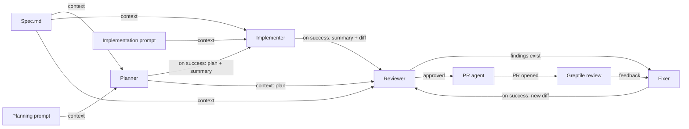

# Columbus Canvas: durable boards and agent workflow orchestration

_Product and implementation plan — 2026-07-27._

_Companion: [`columbus-cross-agent-fork-plan.md`](./columbus-cross-agent-fork-plan.md) — forking a
Claude agent into a Codex agent and back, which builds the vendor-neutral context envelope this
plan's prompt assembly (§6.4) and result envelope (§6.3) depend on._

## 1. Product direction

Columbus should evolve from a freeform board of terminals and session viewers into a
**durable, user-controlled workflow canvas for coding agents**.

The intended experience is:

1. Open a project and choose a starter workflow or an existing board.
2. Configure reusable agent steps, prompts, context wires, trigger wires, and gates.
3. Press **Run workflow**, supply this run's inputs (spec, ticket, branch, PR, or target),
   and review the commands and permissions that will be used.
4. Let Columbus launch each agent only when its prerequisites have completed.
5. Observe every prompt, session, output, diff, transition, and failure from the
   canvas; intervene only at explicit gates or when an agent needs help.
6. Run the workflow again with new inputs, or reproduce a prior run exactly.

The core promise is not simply “run several terminals.” It is:

> Set up the work and the important control boundaries at the beginning, then let
> the workflow advance without manual copying or relaunching between agents.

## 2. What exists today

The current Columbus implementation already provides useful building blocks:

- A freeform persisted graph of prompt, spec, note, terminal, and log nodes.
- Agent configuration for Claude and Codex: working directory, model, mode, and
  effort.
- Context and trigger edge types in the stored model.
- Agent launch into `tmux` + `ttyd`, with embedded interactive terminals.
- Imported, resumed, and forked sessions.
- A live Agent Log node that polls session details and exposes session, goal, plan,
  timeline, context, diff, and turn views.
- Manual composition of incoming spec, prompt, and upstream-agent context.
- Named board archives.

However, the important limitations explain the current observations:

### Saved canvases can disappear

Both the live board and named archives are stored only in browser `localStorage`:

- `fleetlog.columbusWorkspace.v1`
- `fleetlog.columbusArchives.v1`

This data is tied to a particular browser profile and origin (including the dev
server port). It can disappear after browser-data cleanup, origin/port changes, a
different browser, or localStorage failure/quota pressure. It is not part of the
project folder, is not portable, and has no recoverable file history.

### Trigger edges do not orchestrate execution

`ColumbusEdgeKind` includes `trigger`, but newly drawn edges are currently created
as `context`, and edge kinds do not drive a scheduler. Upstream terminal context is
only a short instruction to review changes; it does not carry a stable output,
completion record, exact prompt, or final summary.

### Session logs are observers, not a completion protocol

Agent Log polling makes progress visible, but “the log stopped changing” is not a
safe definition of completion. An agent may be thinking, waiting for permission,
waiting for user input, stalled, disconnected, or finished while its enclosing
shell remains alive.

## 3. Recommended conceptual model

Separate the product into three durable layers:

| Layer | Meaning | Lifetime |
|---|---|---|
| Board definition | Nodes, wires, prompt templates, agent settings, gates | Edited and reused across runs |
| Workflow run | Board snapshot, resolved inputs, and one execution | Immutable history plus live state |
| Step attempt | One launch/retry of one agent step | Exact input, process/session IDs, output, diff, exit result |

This distinction prevents a common failure mode: overwriting the reusable workflow
with transient session state. A board can be edited after a run without changing
the historical prompts or evidence from that run.

### 3.1 Make “Agent Step” the automation primitive

Add a first-class **Agent Step** control card. It is the declarative setup panel the
user described and should contain:

- Name and role: Planner, Implementer, Reviewer, Fixer, PR Agent, or custom.
- Provider/agent: Claude or Codex.
- Working directory.
- Model, effort, permission/sandbox mode.
- Provider adapter and structured setup actions; avoid user-authored shell strings
  where possible.
- A persistent prompt template that always participates in prompt assembly.
- Input bindings: spec, prompt cards, upstream results, upstream summaries, diff,
  review feedback, or explicit files.
- Start policy: manual, on all upstream success, or on any selected event.
- Success policy and optional required output artifacts.
- Timeout, retry policy, and maximum attempts.
- Optional approval gate before launch or after completion.

An Agent Step may launch an embedded terminal and bind an Agent Log automatically.
The current terminal + note + log cluster can remain as its expanded runtime view.

### 3.2 Keep Agent Log observational

The Agent Log should show a new **Run** tab with:

- Current workflow, step, attempt, and lifecycle state.
- Exact assembled input prompt.
- Trigger event that started the step.
- Structured output and final agent summary.
- Changed files/diff and declared artifacts.
- Downstream steps that are ready, blocked, or already triggered.
- Manual controls: approve, trigger, retry, cancel, mark failed, or open terminal.

It can offer a convenient “trigger next” action, but the durable controller—not the
React log component—must perform and record that action.

### 3.3 Give the graph two explicit wire semantics

- **Context wire**: data is available to the target prompt, but it does not start
  the target.
- **Trigger wire**: a lifecycle event from the source may make the target runnable.
  It may also carry selected outputs as context.

The wire inspector should allow:

- Event: `on_success` (default), `on_failure`, `on_needs_input`, or manual.
- Payload: summary, full result, plan artifact, diff, feedback, or no payload.
- Join rule on the target: wait for all required incoming triggers (default) or any.
- Optional condition in a future phase (for example, only trigger Fixer when review
  findings are non-empty).

Use typed input/output ports and prevent incompatible connections. Show wire type,
event, and payload on the canvas so users do not have to open an inspector to
understand execution flow.

### 3.4 Make reuse the default

A board may declare run inputs such as `spec`, `ticket`, `branch`, `pull_request`,
or `environment`. Prompts and bindings reference these values with stable IDs; a
Run dialog validates and resolves them before snapshotting the run.

Run history should offer two distinct actions:

- **Run again**: use the latest board with editable inputs.
- **Reproduce run**: use the historical board snapshot, execution profile, and inputs.

Ship starter workflows for PR review, feature development, implementation review,
test-failure diagnosis, and a basic health check. The empty canvas should offer
these templates instead of requiring every user to start with raw nodes and wires.

## 4. Example workflow



The Reviewer ↔ Fixer cycle must have an explicit maximum iteration count. A graph
cycle without a bound should be rejected before a run starts.

An MVP can omit conditional edges and use a reviewer result with one of two named
outcomes:

- `approved` → PR Agent
- `changes_requested` → Fixer

## 5. Durable storage

### 5.1 Recommended layout

Keep shareable workflow definitions with the project, but store sensitive run
history in Fleetlog's private user data directory by default:

```text
<project>/
  .fleetlog/
    columbus/
      boards/
        <board-id>.json

<fleetlog-user-data>/
  columbus/
    projects/<project-id>/
      runs/
        <run-id>/
          run.json
          events.jsonl
          steps/
            <step-id>/
              attempt-1.json
              input.md
              result.json
              summary.md
              diff.patch
```

Board JSON should contain a stable UUID and a human-readable name; filenames should
not be identity. The board document stores the graph and templates. Run files store
execution snapshots and evidence.

Run history contains materialized prompts, logs, and diffs, so it should not live in a
write-enabled agent's working tree unless the user explicitly exports it there.
Let users choose whether board definitions are shareable and committed:

- **Private**: ignore all `.fleetlog/` content.
- **Share workflow**: commit board definitions only.
- **Export history**: copy selected, redacted run evidence into the project.

Use restrictive permissions, retention and size limits, and redaction before
writing private run data. Exclude Fleetlog metadata from captured diffs.

### 5.2 Persistence behavior

The server layer should own filesystem access through scoped APIs such as:

- `GET /api/columbus/boards?projectId=...`
- `GET /api/columbus/boards/:id?projectId=...`
- `PUT /api/columbus/boards/:id`
- `DELETE /api/columbus/boards/:id`
- `POST /api/columbus/runs`
- `GET /api/columbus/runs/:id`
- `GET /api/columbus/runs/:id/events` (SSE in a later phase)

Required safeguards:

- Establish a trusted project root when the project is opened; do not accept an
  arbitrary client-provided `cwd` as the security boundary.
- Reject traversal outside the selected root.
- Write to a temporary sibling and atomically rename it into place.
- Retain `updatedAt`, format version, and a revision/ETag to detect two tabs
  overwriting one another.
- Never silently replace an unreadable or newer-version file with an empty board.
- Provide explicit save errors and a recovery/export action.

### 5.3 Migration from localStorage

On first opening a project after file persistence ships:

1. Look for project-folder boards.
2. If none exist and localStorage contains a live board or archives, offer
   **Import browser boards into this project**.
3. Write each imported board to disk and verify it can be read back.
4. Keep localStorage unchanged as a recovery copy until the user confirms cleanup.

After migration, localStorage may be a fast unsaved-edit cache, but the file is the
source of truth. Show a real state such as `Saving…`, `Saved to <project>`,
`Unsaved`, or `Save failed` instead of the current generic “saved locally.”

Boards have stable identity and autosave. Use **Duplicate** or **Save as** to create
a new board; do not model ordinary saving as an archive snapshot.

## 6. Workflow execution contract

Reliable automation depends on an explicit contract. Do not infer success from a
quiet log, a final-sounding sentence, or a terminal still being open.

### 6.1 Lifecycle

Recommended step states:

```text
draft → ready → queued → preparing → running
                              ├→ needs_input → running
                              ├→ succeeded
                              ├→ failed
                              ├→ timed_out
                              └→ canceled
```

`succeeded`, `failed`, `timed_out`, and `canceled` are terminal for an attempt.
Retries create a new attempt; they do not mutate the prior attempt.

### 6.2 Completion definition

Automated steps should use a provider-specific, non-interactive execution adapter.
The embedded terminal is an intervention and debugging view, not the lifecycle
authority. Each adapter must build argv/environment without shell interpolation,
launch one bounded turn, stream progress, identify `needs_input`, extract a result,
cancel the process group, and reconcile an attempt after restart.

Completion should require all of:

1. The adapter-owned agent process has exited.
2. The adapter has durably written a completion event with its exit code and time.
3. The controller has captured or generated the final summary.
4. Any step-declared required artifacts exist and pass validation.

Only then may `on_success` trigger wires fire. A zero exit code without required
artifacts is a failed contract, not success.

The existing terminal command keeps a shell alive after the agent exits and may
launch an interactive agent that remains open after one turn. Phase 0 must prove a
one-shot adapter for both vendors rather than infer turn completion from tmux,
ttyd, log quietness, or the enclosing shell.

### 6.3 Result envelope

Every attempt should produce a normalized result, regardless of vendor:

```json
{
  "schemaVersion": 1,
  "status": "succeeded",
  "inferred": false,
  "summary": "Implemented the parser change and added tests.",
  "artifacts": [
    { "kind": "plan", "path": "docs/implementation-plan.md" },
    { "kind": "diff", "path": "steps/implementer/attempt-1/diff.patch" }
  ],
  "outcome": "approved",
  "sessionId": "...",
  "attemptId": "...",
  "exitCode": 0,
  "startedAt": "...",
  "completedAt": "..."
}
```

The controller should save the materialized non-secret prompt as `input.md`, using
redacted references for secret values. The result summary can come from the final
assistant message when available, but Columbus should also add a small,
vendor-neutral result instruction to automated prompts. If an agent does not emit
structured output, the controller may normalize the final message while marking it
as inferred.

### 6.4 Prompt assembly

At the moment a step is queued, construct an immutable prompt snapshot in a stable
order:

1. Step's persistent role/instructions.
2. Resolved run inputs.
3. Explicit project/spec content (prefer content plus source path, not path alone).
4. Saved prompt cards connected to the step.
5. Selected upstream artifacts and summaries.
6. Current diff or review feedback when bound.
7. Output contract and artifact locations.

The UI should preview this assembled prompt before a run. For large inputs, write
artifacts to files and pass paths plus concise summaries rather than pasting an
unbounded transcript. Historical attempts retain their exact input even if the
board prompt cards are edited later. Secret inputs are injected at execution time
but stored only as redacted references; reproducing such a run resolves the secret
again from the local credential store.

## 7. Master controller

The workflow controller should run server-side because browser components can
unmount, refresh, sleep, or lose the connection. Keep it as a durable engine/service
boundary rather than tying its state machine to React or the Vite development-server
lifecycle. Its responsibilities are:

- Validate the graph before starting (missing cwd/spec, dangling edges, cycles,
  unsupported settings, or unreachable required nodes).
- Resolve and validate run inputs, then snapshot the board, execution profile, and
  inputs into the run.
- Capture the starting HEAD, branch, dirty state, and baseline diff; acquire a
  writer lock for each working tree used by a write-enabled step.
- Resolve ready steps using trigger prerequisites and gates.
- Launch provider adapters with deterministic run/attempt identities; never use
  cwd/time matching as an automated session correlation mechanism.
- Record append-only state transitions before emitting downstream triggers.
- Reconstruct active runs after restart using launch intents, deterministic process
  identities, leases/heartbeats, and provider reconciliation.
- Guarantee idempotency: one source completion event may queue each target attempt
  at most once.
- Enforce retries, timeouts, concurrency limits, and bounded loops.
- Cancel downstream queued work when an upstream required step fails, unless a
  failure edge handles it.

An append-only `events.jsonl` should be the audit trail. Give events monotonic
sequence numbers, use a single-writer lock and durable flush, and treat `run.json`
as a materialized view that can be rebuilt from events. Record `launch_requested`
before starting a process and reconcile it after crashes. External effects such as
push or PR creation require their own idempotency keys.

Example event:

```json
{
  "eventId": "uuid",
  "sequence": 14,
  "runId": "uuid",
  "stepId": "reviewer",
  "attempt": 1,
  "type": "step.succeeded",
  "at": "2026-07-27T20:15:00Z",
  "causedBy": "implementer-attempt-1-completed"
}
```

Retries create new attempts against the current working-tree state. Automatic
retry should default to infrastructure failures only; semantic failures and
partially completed write steps require review or an explicit policy. Never
silently reset user or agent changes.

## 8. Canvas UX

### 8.1 Agent Step card

```text
┌ Planner ─────────────────────────── Ready ┐
│ Codex · gpt-5.6-sol · high                │
│ Folder  /project                          │
│ Mode    read-only                         │
│ Trigger Manual / upstream success         │
│ Inputs  Spec.md + Planning prompt         │
│ Output  plan + final summary              │
│                                          │
│ [Preview prompt] [Run step] [More…]       │
└───────────────────────────────────────────┘
```

Keep cards compact. When running, the card shows state and elapsed time; when
complete, it shows the outcome and downstream transition. Put advanced settings,
prompt previews, logs, and the optional terminal in a detail panel so large
terminal/log clusters do not dominate the workflow.

### 8.2 Workflow controls

At board level:

- Validate workflow.
- Open a Run dialog that collects required inputs and summarizes commands, models,
  permissions, working trees, gates, and external effects.
- Run all / run selected subgraph.
- Pause scheduling (do not kill running agents).
- Resume scheduling.
- Cancel run.
- Show run history and reopen a past run in read-only mode.
- Run again with new inputs or reproduce an exact historical snapshot.
- Default maximum parallel agents, initially `1` for predictable shared-worktree
  behavior.

At gates:

- **Approval Gate** node: waits for user approval and optionally lets the user edit
  the downstream prompt.
- **Outcome Router** can be a later node; MVP may route from named outcomes on the
  Agent Step itself.

### 8.3 Important safety affordances

- Warn when two steps can write to the same working tree concurrently.
- Show the starting branch, HEAD, and dirty files before launch; serialize writers
  by resolved working tree unless explicit worktree isolation is configured.
- Default planner/reviewer to read-only; implementer/fixer require explicit write
  permission.
- Show exactly which command, cwd, model, and prompt will be launched.
- Never auto-run a PR/push/external-review step unless that step is explicitly
  enabled for automation.
- Treat permission prompts and required user answers as `needs_input`, visually
  pausing dependent steps.
- Redact known secrets from stored prompt/result previews and warn before sharing
  run history.
- Keep board editing visually distinct from active and historical run views. Show
  inline validation errors on the affected node or wire.

## 9. Suggested data model (v2)

The current v1 model can be migrated rather than replaced in-place.

```ts
type ColumbusBoard = {
  schemaVersion: 2;
  id: string;
  name: string;
  inputs: WorkflowInputDefinition[];
  nodes: ColumbusNodeV2[];
  edges: ColumbusEdgeV2[];
  viewport: ColumbusViewport;
  settings: {
    maxParallelSteps: number;
    defaultTimeoutMinutes: number;
  };
  createdAt: string;
  updatedAt: string;
  revision: number;
};

type WorkflowInputDefinition = {
  id: string;
  label: string;
  type: 'text' | 'file' | 'branch' | 'url' | 'secret';
  required: boolean;
  // Forbidden for secret inputs in a portable board.
  defaultValue?: string;
};

// Local and snapshotted into each run; not part of a portable shared board.
type ExecutionProfile = {
  projectRoot: string;
  providerDefaults: Partial<Record<'claude' | 'codex', ColumbusAgentConfig>>;
  worktreePolicy: 'shared-sequential' | 'isolated';
};

type AgentStepNode = ColumbusNodeBase & {
  kind: 'agent-step';
  title: string;
  agent: ColumbusAgentConfig;
  promptTemplate: string;
  setupActions: SetupAction[];
  inputs: InputBinding[];
  outputs: OutputPort[];
  startPolicy: 'manual' | 'all-upstream-success' | 'any-upstream-event';
  requiredArtifacts: ArtifactRequirement[];
  timeoutMinutes: number;
  maxAttempts: number;
  approval: 'none' | 'before-start' | 'after-success';
};

type ColumbusEdgeV2 = {
  id: string;
  from: { nodeId: string; portId: string };
  to: { nodeId: string; portId: string };
  kind: 'context' | 'trigger';
  event?: 'success' | 'failure' | 'needs-input' | 'manual';
  payload?: ('summary' | 'result' | 'plan' | 'diff' | 'feedback')[];
};
```

Runtime fields such as `sessionId`, live terminal status, and `launchedAt` should
move out of the reusable node definition and into `WorkflowRun` / `StepAttempt`.
Each run also records the board revision, resolved inputs, execution profile,
starting Git state, and an immutable board snapshot.

## 10. Phased implementation plan

### Phase 0 — confirm contracts with a thin vertical prototype

Goal: prove that non-interactive Claude and Codex adapters can emit reliable
completion events independently of the terminal viewer.

- Add one-shot adapters around both vendor CLIs using argv/environment rather than
  an interpolated shell command.
- Persist `started`, exit code, final message/summary, and `completed` to a temp run
  directory.
- Verify success, non-zero failure, timeout, user-input wait, server restart, and
  browser refresh cases for both vendors.
- Verify deterministic attempt/session correlation, cancellation, process-group
  cleanup, and recovery from a recorded launch intent.
- Decide how much final-summary extraction can reuse existing session parsers.

Exit criterion: one finished step can be distinguished reliably from running,
stalled, and failed states without inspecting the terminal visually.

### Phase 1 — file-backed boards

Goal: saved Columbus boards no longer disappear with browser storage.

- Add scoped board filesystem APIs and atomic writes.
- Introduce board IDs, names, revision, timestamps, and schema version 2.
- Add browser-to-project migration and JSON import/export.
- Replace localStorage archives with the project board list.
- Keep localStorage only as a recovery draft cache.
- Add local execution profiles and keep absolute roots out of portable boards.
- Add Duplicate/Save as and clear autosave/conflict states.
- Add persistence, traversal, corruption, migration, and concurrent-revision tests.

Exit criterion: a board survives browser/profile/origin changes and opens from the
project folder with all nodes, prompts, configuration, edges, and viewport intact.

### Phase 2 — Agent Step card and run records

Goal: configure and repeatedly run useful automation without pre-creating live
terminals.

- Add `agent-step` and persistent prompt/setup fields.
- Add workflow input definitions, a pre-run dialog, and resolved input snapshots.
- Ship a simple PR-review starter workflow.
- Add prompt preview with deterministic input assembly.
- Create immutable workflow runs and step-attempt directories.
- Launch a single step through the provider adapter.
- Automatically bind its terminal and Agent Log runtime view.
- Add the Agent Log **Run** tab.

Exit criterion: a user can start from a template, run one step, refresh the page,
inspect its evidence, and run it again with new inputs.

### Phase 3 — trigger scheduler (linear DAG first)

Goal: Planner → Implementer → Reviewer advances automatically.

- Add explicit context/trigger wire editing.
- Implement graph validation and `on_success` + all-upstream join semantics.
- Persist the event log and idempotency keys.
- Implement launch-intent reconciliation, locks/leases, and controller recovery
  after server restart.
- Add pause, resume, cancel, retry, and manual approval gates.
- Capture baseline Git state and start with one writer per working tree.

Exit criterion: a three-step linear workflow runs once end-to-end, never launches a
downstream step twice, and safely stops on failure or required input.

### Phase 4 — outcomes, bounded review/fix loops, and parallelism

Goal: support reviewer-directed correction without manual relaunching.

- Add named outcomes (`approved`, `changes_requested`).
- Add conditional routing and maximum loop iterations.
- Add diff/result bindings and feedback payloads.
- Add opt-in concurrency with shared-worktree conflict detection; recommend
  worktrees when parallel writers are required.

Exit criterion: Reviewer can route to Fixer and back, then advance to PR only after
approval, with a visible and bounded attempt history.

### Phase 5 — PR and external review adapters

Goal: automate the optional tail of the workflow without hard-coding it into the
core scheduler.

- Add an adapter interface for commands and external jobs.
- Implement PR creation/status using the existing authenticated environment.
- Add a Greptile adapter only after confirming its available API/webhook/CLI
  completion signal.
- Normalize external review feedback into the same result envelope.
- Require explicit authorization for push, PR creation, and external submission.

Exit criterion: an approved implementation can open a PR, wait for an external
review completion event, and route actionable feedback to a Fixer step.

### Phase 6 — schedules and monitoring

Goal: support recurring monitoring without weakening the finite coding-workflow
contract.

- Add schedule and event trigger adapters, overlap and missed-run policies,
  credential references, retention, and notifications.
- Treat long-running monitors as external jobs that emit normalized results rather
  than as indefinitely running agent steps.

Exit criterion: a health-check workflow runs repeatedly, prevents accidental
overlap, records each run separately, and notifies the user on configured outcomes.

## 11. Testing strategy

Prioritize state-machine and recovery tests over visual tests:

- Board round-trip, schema migration, atomic-write interruption, corrupt file, and
  stale-revision conflict.
- Graph validation: dangling input, cycle, unbounded loop, missing source,
  incompatible outcome, and conflicting writers.
- Prompt snapshot ordering, size limits, artifact references, and secret redaction.
- Workflow input validation, template resolution, Run again, and exact reproduction.
- Controller idempotency under repeated completion events, crash windows, and page
  refreshes.
- Provider adapter: success, non-zero exit, signal, timeout, missing result, and
  `needs_input` recovery.
- Controller restart during preparing, launch, running, and downstream scheduling.
- Retry creates a new attempt and never erases prior evidence.
- Dirty-worktree baseline, writer locking, partial write failure, and retry behavior.
- End-to-end Planner → Implementer → Reviewer happy path.
- End-to-end Reviewer → Fixer → Reviewer bounded loop.

## 12. Decisions to validate before implementation

These choices affect product behavior enough to confirm with a small prototype or
user decision:

1. **Storage:** keep boards in the project and private run history in Fleetlog's
   user data directory; confirm retention and export defaults.
2. **Share policy:** decide whether board definitions are committed or private by
   default; never store secret input values in a shared board.
3. **Agent completion adapter:** confirm vendor CLI flags/output and the adapter
   event mechanism for both Claude and Codex.
4. **Worktree strategy:** keep all sequential steps in one working tree; decide
   whether Columbus should create worktrees automatically for parallel branches.
5. **Prompt size policy:** prefer artifact paths + summaries above a threshold,
   while retaining the materialized non-secret prompt and redacted secret references.
6. **Approval defaults:** recommended automatic Planner → Implementer → Reviewer,
   with an approval gate before PR/push/external-review actions.
7. **Monitoring scope:** keep scheduled and long-running monitoring in Phase 6;
   earlier phases support finite, manually started coding workflows.

## 13. Recommended first milestone

Build **Phase 0 + Phase 1 + a thin Phase 2 slice** first.

File-backed boards immediately fix the data-loss concern. The provider adapter is
the highest-risk technical assumption behind every automated workflow; proving
it early prevents building trigger UI on an unreliable signal. Include workflow
inputs, the Run dialog, one PR-review template, a single automated step, and **Run
again** so the first user-visible milestone also proves the repeat-workflow promise.

## 14. Implementation status — 2026-07-28

Phase 1 foundation is in progress:

- Implemented explicit project selection and schema-v2 board documents.
- Implemented atomic file writes, revisions, stale-write conflicts, corruption and
  newer-version protection, traversal checks, and symlink-safe storage paths.
- Replaced browser archives in the active UI with project board open/save,
  autosave, duplicate, delete, recovery-draft, and localStorage import flows.
- Remaining Phase 1 work: broader UI testing and JSON import/export.
